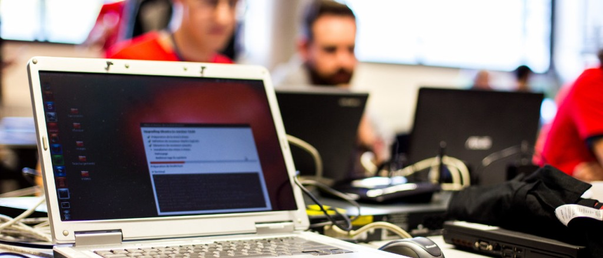

---
title: 'Linux Presentation Day 2016.1 en France'
summary: 'Samedi 30 avril aura lieu une journée de présentation de GNU/Linux'
date: 2016-03-30

lang: french
fontfamily: quattrocento
geometry: margin=1.25in
...

# Communiqué de presse

## Journée de présentation de GNU/Linux

Le **samedi 30 avril 2016** aura lieu une journée de présentation de GNU/Linux et des logiciels libres dans toute l'Europe, "Linux Presentation Day". Cette journée sera l'occasion de démonstrations, ateliers et install parties en Allemagne, Autriche, Suisse, Portugal, Italie et France.

En France, plusieurs associations et autres organisations organisent des manifestations lors de cette journée, dans divers lieux. [Le site internet](http://linux-presentation-day.fr/) affichera tous ces événements bientôt.

**Linux Presentation Day** a été initié par le LUG de Berlin en 2014, et est organisé deux fois par an dans plusieurs pays depuis 2015.

Un [logiciel libre](http://www.april.org/articles/intro/ll.html) donne un certain nombre de libertés aux utilisateurs :

* la liberté **d'utiliser le logiciel**, pour quelque usage que ce soit (liberté 0)

* la liberté **d'étudier le fonctionnement du programme, et de l'adapter à vos propres besoins** (liberté 1). L'accès au code source est une condition pour tout ceci  

* la liberté **de redistribuer des copies** de façon à pouvoir aider votre voisin (liberté 2)  

* la liberté **d'améliorer le programme, et de diffuser vos améliorations au public**, de façon à ce que l'ensemble de la communauté en tire avantage (liberté 3). L'accès au code source est une condition pour tout ceci.

Des logiciels libres pour naviguer sur internet, faire du traitement de texte, de la retouche photo ou de la création graphique, voir des vidéos, ou même jouer ... Tout cela vous pourrez le découvrir lors de cette journée dédiée !
